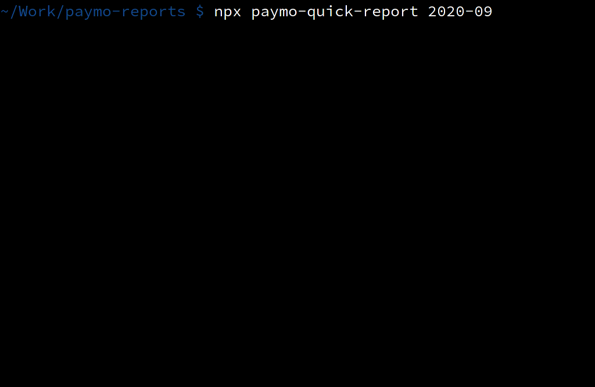

# Quick paymo report

Time is mana and you want to know how much should you put on that invoice. Calculates invoice for you based on time spent in Paymo and your salary, adding some self canceling schwarz offset. It takes holidays into account, based on your locale.



## Installation

One quick step...

```
npm -g install paymo-report
```

## Configuration

Configure following environmental variables

* `PAYMO_API_KEY` This is your [Paymo API key](https://help.paymoapp.com/en/articles/888790-paymo-api)
* `SALARY` This is your salary
* Optionally configure/override `LC_MESSAGES` or `LC_ALL` or `LANG` so the script can tell what holiday calendar you follow
